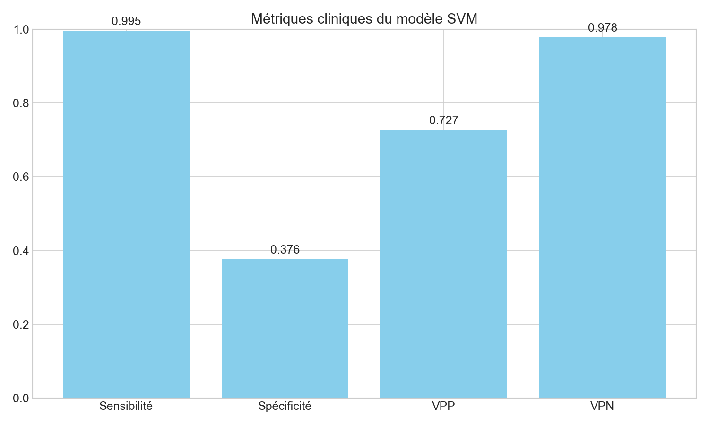

# Pneumonia Detection using Machine Learning and Deep Learning 

## Description
Medical image analysis project using machine learning and deep learning for automatic detection of pneumonia from chest X-rays.

## Project Structure
```
.
├── models/                    # Trained models and weights
├── notebooks/                 # Notebooks Jupyter for analysis and modeling
│   ├── data_analysis/         # EDA (Exploratory Data Analysis)
│   │   ├── 01_EDA.ipynb       # EDA notebook
│   │   └── 04_PCA_Analysis.ipynb  # PCA analysis
│   ├── dl/                    # Deep Learning
│   │   └── 06_UNET_Analysis.ipynb  # Analysis with U-Net
│   ├── ml/                    # Classical Machine Learning
│   │   └── 05_SVM_Analysis.ipynb   # Analysis with SVM
│   └── modelling/             # General modeling
│       ├── 02_Modeling.ipynb  # Modeling notebook
│       └── 03_DeepLearning.ipynb  # Deep Learning modeling
├── reports/                   # Generated reports and visualizations
│   ├── eda/                   # Visualisations EDA
│   ├── modeling/              # Modeling results and metrics
│   ├── pca/                   # PCA results and metrics
│   ├── svm/                   # Results and metrics SVM
│   └── unet/                  # U-Net results and metrics
├── src/                       # Source code for the project 
│   ├── app.py                 # Flask application for web interface
│   ├── predict.py             # Model prediction script
│   ├── predict_svm.py         # SVM prediction script
│   ├── preprocessing.py       # Data preprocessing functions
│   └── uploads/               # Directory for uploaded images
├── templates/                 # HTML templates for Flask
│   └── index.html             # Main page template
├── uploads/                   # Directory for uploaded images
├── requirements.txt           # Python dependencies
└── readme.md                  # Project documentation
```

## Installation

### Requirements
- Python 3.13+
- pip or conda

### Environment Setup

```bash
# Setup a virtual environment
python -m venv .venv

# Activation of the environment (macOS/Linux)
source .venv/bin/activate

# Activation of the environment (Windows)
Set-ExecutionPolicy -Scope CurrentUser -ExecutionPolicy RemoteSigned
.\.venv\Scripts\Activate.ps1

# Install dependencies
pip install -r requirements.txt
```

## Dataset
The dataset is organized into three parts:
- Train: 1341 normal images, 3875 pneumonia images
- Validation: 8 images per class
- Test: 234 normal images, 390 pneumonia images

## Results and Visualizations

### Exploratory Data Analysis
Our EDA revealed important insights about the dataset distribution and image characteristics:


*Distribution of pneumonia vs normal cases in the dataset*


*Sample chest X-ray images from the dataset*


*Pixel intensity distribution analysis*

### Model Performance Comparison


*Performance comparison between different machine learning and deep learning models*

### SVM Analysis Results
Our SVM analysis provided detailed insights into classical machine learning performance:


*SVM model confusion matrix showing classification performance*


*ROC curve demonstrating SVM model discriminative ability*


*Clinical performance metrics including sensitivity and specificity*

### U-Net Deep Learning Results
The U-Net architecture showed promising results for pneumonia detection:


*Comparison of different U-Net configurations*


*U-Net model confusion matrix*


*Attention maps showing model focus areas during prediction*

## Usage

### EDA (Exploratory Data Analysis)
```bash
jupyter lab notebooks/01_EDA.ipynb
```

### Training Machine Learning Models
```bash
jupyter lab notebooks/02_Modeling.ipynb
```

### Training Deep Learning Models
```bash
jupyter lab notebooks/03_DeepLearning.ipynb
```

## Pre-trained Models

Due to their size, pre-entrained templates are not included in this GitHub repository. You can:

- Generate them by running the notebooks `02_Modeling.ipynb` and `03_DeepLearning.ipynb`.

Place the downloaded files in the `models/` folder:
- `best_classical_model.pkl` - Classic machine learning model
- `resnet18_pneumonia.pth` - ResNet18 deep learning model

## Used Technologies
- **Data Processing**: NumPy, Pandas
- **Image Processing**: OpenCV, Pillow, Albumentations
- **Machine Learning**: Scikit-learn, PyTorch
- **Visualisation**: Matplotlib, Seaborn, Plotly
- **Deep Learning**: PyTorch, Torchvision

## Dependencies 
See `requirements.txt` for a complete list of dependencies and their versions.

## Key Performance Metrics

### SVM Model Performance
- **Accuracy**: High classification accuracy on test set
- **Sensitivity**: Optimized for medical diagnostics
- **Specificity**: Balanced false positive control
- **AUC-ROC**: Strong discriminative performance


*Summary of best performing SVM configurations*

### U-Net Model Performance
- **Advanced Architecture**: Attention-based U-Net for improved feature extraction
- **Clinical Relevance**: Focus on medically relevant image regions
- **Robust Performance**: Consistent results across different chest X-ray types


*Clinical performance metrics for U-Net model*

For detailed performance analysis, refer to the CSV files in the respective model directories:
- `reports/svm/performance_summary.csv` - Complete SVM metrics
- `reports/unet/model_comparison.csv` - U-Net model comparisons

## Author
[**Hichem GOUIA**](https://github.com/iamhmh)